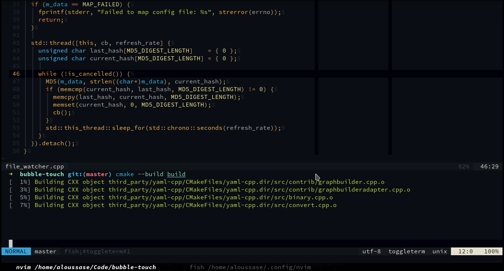

# dotfiles



## Contents

```
~> emacs = text editor
~> fish  = shell
~> kitty = terminal
~> nvim  = text editor
~> R     = R related stuff
~> rofi  = command palette / fuzzy finder
```

## Installation

### nvim

To install in `$XDG_CONFIG_HOME`:

```bash
curl https://raw.githubusercontent.com/aloussase/dotfiles/master/scripts/install_nvim.sh | bash
```

Or to specify an installation directory:

```bash
curl https://raw.githubusercontent.com/aloussase/dotfiles/master/scripts/install_nvim.sh \
    | bash -s -- $PWD/here
```

## License

MIT
